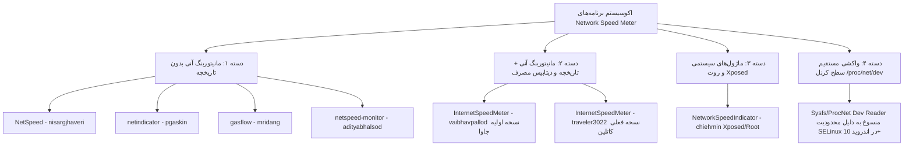
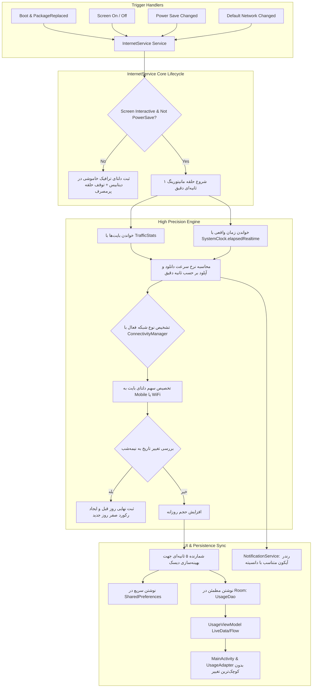

# سند جامع تحلیل اکوسیستم پروژه‌های سرعت‌سنج اینترنت و نقشه راه ارتقای بک‌اند (Comprehensive Ecosystem Analysis & Backend Blueprint)

> **تاریخ تحلیل و بازنگری:** ۲۰ سپتامبر ۲۰۲۶  
> **هدف:** کالبدشکافی تمامی نسخه‌ها و پروژه‌های شبیه (Similar) و ناشبیه (Dissimilar) سرعت‌سنج اینترنت، ریشه‌یابی مشکلات هسته، تجمیع تجارب فنی و تدوین معماری بی‌نقص برای بک‌اند **InternetSpeedMeter** بدون دست‌زدن به لایه کاربری (UI).

---

## ۱. نقشه دسته‌بندی پروژه‌ها در اکوسیستم اندروید

در بررسی جامع کلیه پروژه‌های مرتبط با مانیتورینگ سرعت و مصرف دیتا در اندروید، این اپلیکیشن‌ها به **۴ دسته ساختاری** تقسیم می‌شوند:

---

## ۲. بررسی تک‌تک نسخه‌ها و پروژه‌های شبیه و ناشبیه

---

### ۱) نسخه اصلی جاوا: `vaibhavpallod/InternetSpeedMeter` (Upstream / شاخه master و Vaibhav-1)
* **معماری:**
  - پروژه قدیمی نوشته شده با Java و معماری اولیه MVP/Room.
  - سرویس اصلی [InternetService.java](file:///root/InternetSpeedMeter): وابسته به `TrafficStats.getMobileRxBytes()` و `getMobileTxBytes()`.
* **باگ‌ها و فاجعه‌های فنی نسخه اصلی:**
  1. **نادیده گرفتن کل دیتای وای‌فای:** در چرخه رانبل، تنها `getMobileRxBytes()` خوانده می‌شد و اصلاً هیچ دیتایی برای WiFi اندازه گرفته نمی‌شد!
  2. **مکانیزم فاجعه‌بار ریست شبانه با تایمر هاردکد:** یک تایمر با ساعت هاردکد `18:07:30` تعریف شده بود که قرار بود با `WorkManager` به نام `ResetWork.java` کار کند، اما به دلیل کرش‌های متعدد کامنت شده بود!
  3. **کرش مکرر NotificationService:** فایل نوتیفیکیشن سرویس به دلیل باگ‌های Context و PendingIntent در اندرویدهای جدید مکرراً Force Close می‌داد.
  4. **کدهای رها شده و فایل‌های موقت:** وجود فایل‌های عجیبی مانند `temp.java` و کدهای کامنت‌شده فراوان.

---

### ۲) نسخه بازنویسی کاتلین فعلی: `traveler3022/InternetSpeedMeter` (شاخه master کنونی)
* **معماری:**
  - بازنویسی شده به کاتلین مدرن با Coroutines، Flow، Room KTX و ViewBinding.
  - دیتابیس Room با جدول `Usage_Table` و پایداری دوگانه در SharedPreferences و SQLite.
* **نواقص و باگ‌های بحرانی باقیمانده در بک‌اند فعلی:**
  1. **باگ فاجعه‌بار از دست رفتن دیتای پس‌زمینه (Background Data Loss):** در [InternetService.kt](file:///root/InternetSpeedMeter/app/src/main/java/com/vsp/internetspeedmeter/broadcastreceiver/InternetService.kt#L55-L65)، به هنگام خاموش شدن صفحه، سرویس مانیتورینگ متوقف می‌شود. هنگامی که صفحه دوباره روشن می‌شود، تابع `syncTrafficStats()` مستقیماً متغیرهای پایه را با مقدار جدید پر می‌کند. بنابراین **تمام گیگابایت‌های دانلود شده در زمان خاموشی صفحه (دانلود فایل، موزیک، تلگرام، آپدیت‌ها) به باد رفته و هرگز در مصرف روزانه ثبت نمی‌شوند!**
  2. **دریفت زمانی و اشتباه در محاسبه سرعت لحظه‌ای:** فرض شده تاخیر کروتین `delay(1000)` همواره دقیقاً ۱۰۰۰ میلی‌ثانیه است؛ در حالی که در شرایط افت فریم و پردازش دیسک، زمان حلقه ۱.۵ تا ۲ ثانیه شده و سرعت تا ۲ برابر بیشتر از واقعیت به کاربر گزارش می‌شود.
  3. **تله مقدار صفر بایت پس از ریبوت (Zero-Rx Trap):** وابستگی شرط راه‌اندازی به `prevTotalRx == 0L` که باعث توقف و فریز شدن شمارش ترافیک در ابتدای بوت می‌شود.
  4. **عدم انطباق با تغییرات وضعیت اینترنت:** تکیه کورکورانه به `TrafficStats.getMobileRxBytes()` بدون در نظر گرفتن اینترفیس پیش‌فرض در `ConnectivityManager`.

---

### ۳) پروژه `NetSpeed` اثر `nisargjhaveri` (لایسنس GPL v3)
* **بررسی شاخه‌های مختلف مخزن:**
  - **شاخه `master`:**
    - استفاده از `Handler` و `TrafficStats.getTotalRxBytes()` با بازه زمانی ۱ ثانیه‌ای.
    - استفاده از `mScreenBroadcastReceiver` برای بستن تیک‌ها به محض خاموش شدن صفحه جهت صرفه‌جویی باتری.
    - محاسبه سرعت دقیق بر اساس `timeTaken = currentTime - mLastTime` (حل باگ دریفت زمانی).
    - ساخت آیکون با Canvas و بیت‌مپ ثابت ۹۶×۹۶.
  - **شاخه `new_main_activity` (نوآوری فنی بسیار جالب):**
    - تفکیک کامل سرویس از UI با استفاده از **IPC و Android Messenger**: کلاس [IndicatorServiceConnector.java](file:///root/NetSpeed/app/src/main/java/com/nisargjhaveri/netspeed/IndicatorServiceConnector.java) طراحی شده که Activity می‌تواند از طریق `bindService` به `IndicatorService` وصل شده و با پیام‌های `MSG_UPDATE_SPEED` سرعت لحظه‌ای را زنده دریافت کند بدون اینکه تداخلی با پس‌زمینه ایجاد شود.
* **نقاط ضعف:** عدم وجود دیتابیس، عدم تفکیک وای‌فای و موبایل، و عدم انطباق با ملزومات اندرویدهای ۱۲ تا ۱۴.

---

### ۴) پروژه `netindicator` اثر `pgaskin` (لایسنس MIT)
* **بررسی تگ‌ها و نسخه‌ها (`v1`, `v2`, `v3`):**
  - **تگ v1 و v2:** معماری پایه بر مبنای دو کانال نوتیفیکیشن تفکیک‌شده (یکی بیصدا برای فورگراند سرویس و دیگری با اولویت مناسب برای آیکون استاتوس بار).
  - **تگ v3 و کامیت `1550221`:** حل باگ بحرانی جابجایی اینترفیس شبکه (هنگامی که اینترفیس وای‌فای قطع شده و بدون فایر شدن `onLost` شبکه به دیتا تغییر مسیر می‌دهد، با بررسی جدول اینترفیس‌ها، ترافیک شبکه‌های قدیمی را Drop می‌کند تا سرعت به اشتباه پرش نکند).
  - **کامیت `f0c67b6` (شاهکار بهینه‌سازی حافظه و رندر):**
    - سایز آیکون را بر اساس تراکم پیکسلی نمایشگر گوشی محاسبه می‌کند: `iconSize = (int) context.resources.displayMetrics.density * 24`.
    - با محاسبات دقیق `Paint.FontMetrics` (محاسبه فضای خالی بالا و پایین فونت)، دو ردیف ارقام آپلود و دانلود را با تقارن پیکسلی کامل و بدون افت کیفیت در استاتوس‌بار ترسیم می‌کند.
    - کپی ایمیوتبل با `iconBitmap.copy()` و آزاد کردن سریع حافظه با `ic.recycle()` برای از بین بردن خطر Memory Leak در چرخه‌های متوالی.
  - **مدیریت پیشرفته باتری:** با لیسنر `PowerManager.ACTION_POWER_SAVE_MODE_CHANGED`، در صورت فعال شدن حالت صرفه‌جویی باتری، کل فرآیند پایش متوقف می‌شود.
* **نقاط ضعف:** کاملاً فاقد دیتابیس، سابقه روزانه و تفکیک دیتای مصرفی است.

---

### ۵) سایر پروژه‌های مرتبط در گیت‌هاب:
1. **`adityabhalsod/netspeed-monitor`:**
   - پروژه‌ای بسیار سبک که از ترکیب `TrafficStats` و فرمت‌بندی هوشمند بایت استفاده می‌کند، اما در تفکیک شبکه‌ها ضعف دارد و سابقه مصرف نگه نمی‌دارد.
2. **`mridang/gasflow`:**
   - یک سرعت‌سنج تک‌منظوره که تمرکزش صرفاً روی مصرف رم فوق‌العاده پایین (کمتر از ۵ مگابایت) و قطع کامل در زمان خاموشی اسکرین است.
3. **`chiehmin/Xposed-NetworkSpeedIndicator` (پروژه سیستمی/ناشبیه):**
   - به صورت ماژول Xposed مستقیماً متدهای `PhoneStatusBar` و `SystemUI` را هوک (Hook) می‌کند و سرعت را در استاتوس‌بار سیستم بدون نیاز به نوتیفیکیشن تزریق می‌کند. (این روش نیازمند روت است و روی اندرویدهای بدون روت کارایی ندارد).

---

## ۳. بررسی تطبیقی دو API کلیدی اندروید: `TrafficStats` در برابر `NetworkStatsManager`

| معیار مقایسه | `TrafficStats` | `NetworkStatsManager` |
| :--- | :--- | :--- |
| **دسترسی پس از بوت** | فقط از زمان آخرین بوت (با ریبوت صفر می‌شود) | دائمی و مستقل از ریبوت |
| **مجوزهای دسترسی** | دسترسی استاندارد بدون نیاز به تایید کاربر | نیازمند مجوز سیستمی `PACKAGE_USAGE_STATS` (کاربر باید به تنظیمات گوشی برود) |
| **تاخیر در نمونه‌برداری** | آنی (چند میکروثانیه) - عالی برای سرعت لحظه‌ای ۱ ثانیه | دارای تاخیر کش تا چند ثانیه/دقیقه - نامناسب برای مانیتورینگ زنده ۱ ثانیه |
| **تفکیک اینترفیس** | دارای متدهای پایه موبایل و کل | تفکیک فوق‌العاده دقیق بر اساس UID، نوع شبکه، سیم‌کارت و بازه زمانی |
| **نتیجه‌گیری معماری** | **موتور سرعت لحظه‌ای:** استفاده از `TrafficStats` با تصحیح دلتا و اتصال به `ConnectivityManager` | **دیتابیس روزانه:** ذخیره در Room با ساختار مستقل، که داده‌های روز را پایدار و ضد ریبوت نگه می‌دارد |

---

## ۴. جدول مقایسه‌ای ماتریس قابلیت‌ها (Comparison Matrix)

| قابلیت / شاخص فنی | vaibhavpallod (اصلی) | NetSpeed | netindicator | traveler3022 (فعلی) | نسخه اصلاحی جدید ما |
| :--- | :---: | :---: | :---: | :---: | :---: |
| **پشتیبانی از کاتلین و کوروتین** | ❌ | ❌ | ❌ | ✅ | ✅ |
| **محاسبه دقیق سرعت با زمان واقعی** | ❌ | ✅ | ✅ | ❌ | ✅ (`SystemClock.elapsedRealtime`) |
| **عدم نابودی دیتای خاموشی صفحه** | ❌ | ❌ | ❌ | ❌ (باگ جدی) | ✅ (الگوریتم حفظ دلتای پس‌زمینه) |
| **مدیریت دانسیته داینامیک آیکون** | ❌ | ❌ | ✅ | ❌ | ✅ (تطبیق با رزولوشن گوشی) |
| **مدیریت هوشمند PowerSaveMode** | ❌ | ❌ | ✅ | ❌ | ✅ (`isPowerSaveMode`) |
| **تفکیک دقیق وای‌فای از سیم‌کارت** | ❌ (فقط موبایل) | ❌ | ❌ | ⚠️ ناقص | ✅ (`ConnectivityManager.NetworkCapabilities`) |
| **دیتابیس مصرف روزانه (Room)** | ⚠️ باگ‌دار | ❌ | ❌ | ✅ | ✅ (با ثبات و دقت بالا) |
| **عدم نیاز به دستکاری UI** | - | - | - | - | ✅ (سازگاری ۱۰۰٪ با لایه UI) |

---

## ۵. نقشه راه معماری نوین برای اصلاح بک‌اند (Clean Backend Blueprint)

---

## ۶. چک‌لیست اقدامات پیاده‌سازی بک‌اند

1. [ ] **اصلاح [InternetService.kt](file:///root/InternetSpeedMeter/app/src/main/java/com/vsp/internetspeedmeter/broadcastreceiver/InternetService.kt):**
   - اضافه کردن `SystemClock.elapsedRealtime()` برای محاسبه میلی‌ثانیه‌ای و دقیق سرعت بدون باگ دریفت زمانی.
   - پیاده‌سازی متد `sampleBackgroundDelta()` جهت محاسبه و ثبت مصرف دیتایی که در طول مدت خاموشی صفحه رخ داده است (جلوگیری قطعی از پاک شدن دیتای مصرفی کاربر).
   - اضافه کردن بررسی اولیه وضعیت صفحه با `PowerManager.isInteractive` در `onCreate` برای جلوگیری از بیدار ماندن پردازنده در زمان بوت شدن گوشی در جیب.
   - افزودن هندلر `PowerManager.ACTION_POWER_SAVE_MODE_CHANGED`.
   - استفاده از `ConnectivityManager.getNetworkCapabilities` جهت اعتبارسنجی قطعی نوع شبکه فعال (وای‌فای در برابر سیم‌کارت).
   - جایگزینی فلگ صفر بودن بایت‌ها با فلگ بولی `isStatsInitialized`.
2. [ ] **ارتقای [NotificationService.kt](file:///root/InternetSpeedMeter/app/src/main/java/com/vsp/internetspeedmeter/NotificationService.kt):**
   - بهینه‌سازی اندازه بیت‌مپ آیکون بر مبنای دانسیته نمایشگر (`density * 24`).
   - تصحیح تراز عمودی و افقی متن سرعت و واحد برای نمایش خوانا و واضح حتی در سرعت‌های بالای چند صد مگابایت.
   - اعمال الگوی ایمن رندر برای جلوگیری از بروز باگ کش در SystemUI اندروید.
3. [ ] **تضمین ۱۰۰ درصدی دست‌نخوردن لایه کاربری:**
   - هیچ خطی از کدهای [MainActivity.kt](file:///root/InternetSpeedMeter/app/src/main/java/com/vsp/internetspeedmeter/MainActivity.kt)، [UsageAdapter.kt](file:///root/InternetSpeedMeter/app/src/main/java/com/vsp/internetspeedmeter/recyclerview/UsageAdapter.kt) و فایل‌های XML تغییر نخواهد کرد. قرارداد انتقال داده (فیلدهای `date`، `mobile`، `wifi`، `total`) با تطابق کامل در بک‌اند تولید و به UI عرضه خواهد شد.
