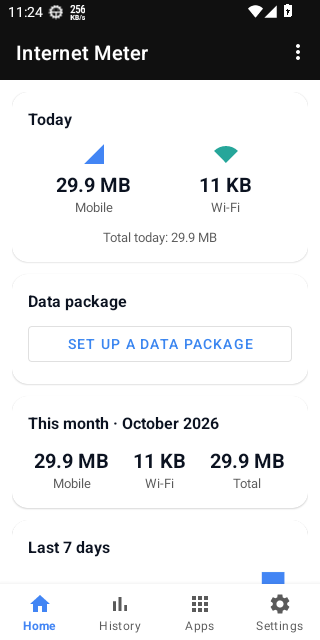
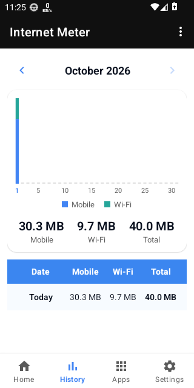
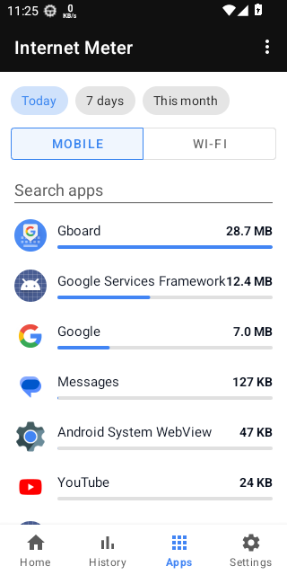
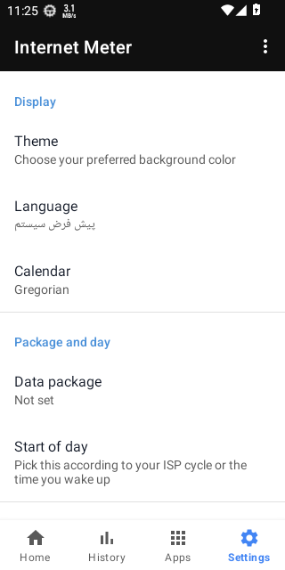
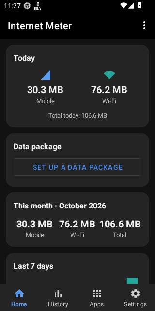

# Internet Speed Meter

[فارسی](README.fa.md)

A small Android app that shows your live internet speed in the status bar and keeps a daily record of how much mobile and Wi-Fi data you use.

## Features

- **Status-bar speed**: the current speed is drawn as the notification icon, with download, upload and today's mobile / Wi-Fi totals in the notification itself. Speed can be shown in bytes or bits.
- **Home**: today's mobile and Wi-Fi usage, your data package (size, start day, length, used, left, days left), this month, and the last 7 days.
- **History**: month by month with a daily chart, month totals and past days. Gregorian or Solar Hijri (Jalali) calendar.
- **Apps**: usage per app for today, 7 days or the month, mobile or Wi-Fi, searchable. Hotspot traffic appears as its own row, and an app opens its last 30 days. Needs *Usage access*.
- **Monthly mobile limit** shown in the notification.
- **Backup and restore** of the daily table, home-screen widget and a quick-settings tile.
- Three themes (light, purple, dark), Persian and English, configurable start of the day, optional start on boot, optional pause while the screen is off.

Traffic is measured with the counters Android itself keeps (`TrafficStats`), so the numbers come from the system rather than from the app guessing.

## Screenshots

<p>
  
  
  
  
  
</p>

## Requirements

Android 6.0 (API 23) or newer. Notifications must be allowed; Usage access and battery-optimisation exemption are optional but recommended. The first-start page asks for all three.

## Install

Debug builds are published on the [Releases](../../releases) page (`v1.1-debug`) and rebuilt on every push to `main`.

## Build

```bash
./gradlew assembleDebug
```

The APK ends up in `app/build/outputs/apk/debug/app-debug.apk`. CI (GitHub Actions) builds it and runs the unit tests (`./gradlew testDebugUnitTest`).

## Origins and credits

This project is honest about where it comes from:

- **Vaibhav Pallod's [InternetSpeedMeter](https://github.com/vaibhavpallod/InternetSpeedMeter)** is where this started. The first version of the app (a Java project, 2021: the speed service, the Room database of daily usage, the usage list) was his work, and the package name `com.vsp.internetspeedmeter` comes from it. Since then the app has been rewritten in Kotlin and extended with a new interface, but the idea and the starting point are his, and he deserves the credit for them. None of his source files remain in the current code.
- **Internet Speed Meter Lite** is a separate app by its own developers, and this project owes it a lot. The look of the notification (the speed drawn as the status-bar icon, its sizes and texts) and the way the speed is calculated (a one-second tick, the difference of the system counters per tick) are taken from it. To get them right we studied how it behaves and, in places, read its decompiled code. The rest of the code is our own work, and none of its images or branding is used here. Internet Speed Meter Lite remains the work and property of its authors. If you like the idea, go and look at it.
- **jalaali-js** by Behrang Norouzinia (MIT): the Jalali calendar conversion in `Jalali.kt` is a port of it. See [THIRD_PARTY_NOTICES.md](THIRD_PARTY_NOTICES.md).
- Built on AndroidX, Room, Material Components and Kotlin coroutines (all Apache 2.0).

If you are one of the people credited above and something here should be worded differently, please open an issue.

## License

[MIT](LICENSE). It covers the code written for this project; the third-party parts named above keep their own terms.
